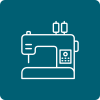

---
hide :
    -toc
    -footer
    -feedback
search:
  exclude: true
---

# Documentation

- [{ width=300em}](../broderie-numerique/index.md)
    [**Broderie numérique**](../broderie-numerique/index.md)

- [{ width=300em}](../decoupe-numerique/index.md)
    [**Découpe numérique**](../decoupe-numerique/index.md)

- [{ width=300em}](../impression3d/index.md)
    [**Impression 3D**](../impression3d/index.md)

- [{ width=300em}](../medias-numeriques/index.md)
    [**Médias numériques**](../medias-numeriques/index.md)

- [{ width=300em}](../programmation/index.md)
    [**Programmation**](../programmation/index.md)

- [{ width=300em}](../vr/index.md)
    [**Réalité Virtuelle**](../vr/index.md)

- [{ width=300em}](../systemes-embarques/index.md)
    [**Systèmes embarqués**](../systemes-embarques/index.md)

