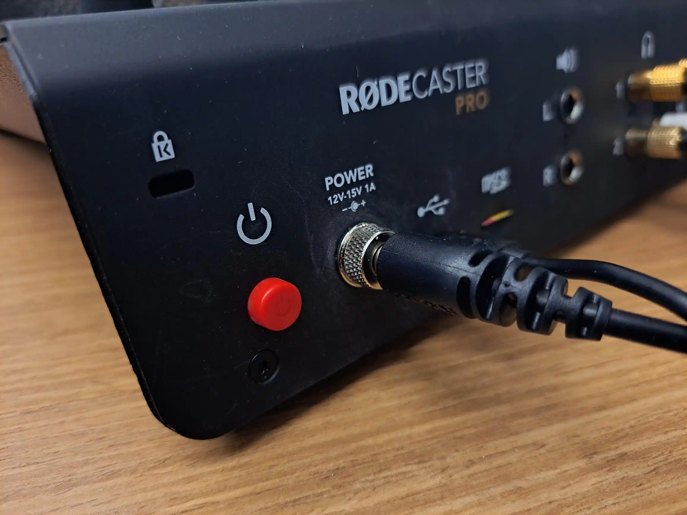
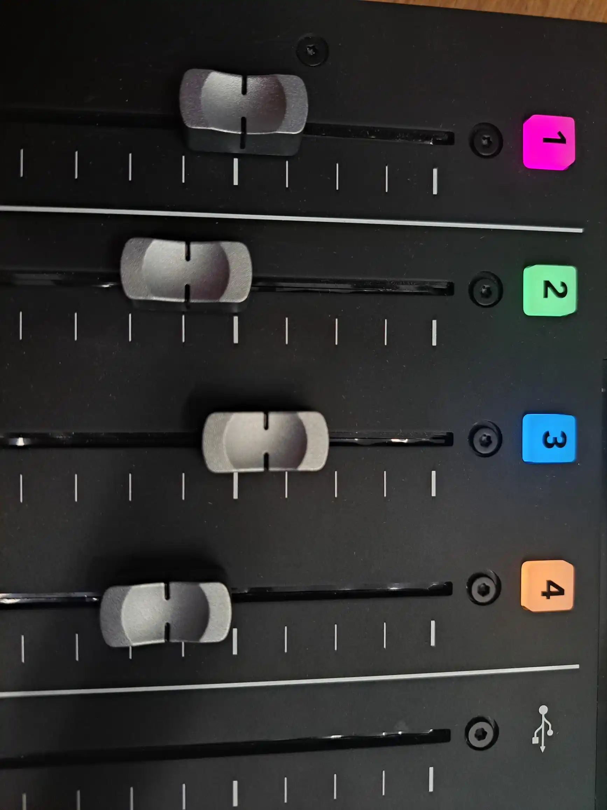
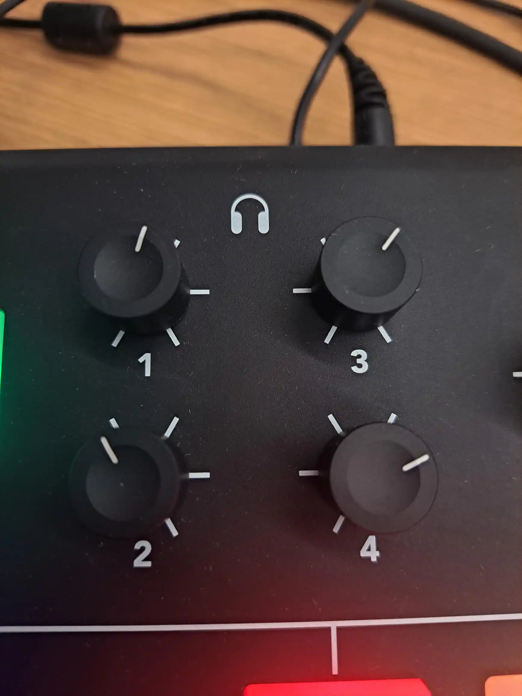
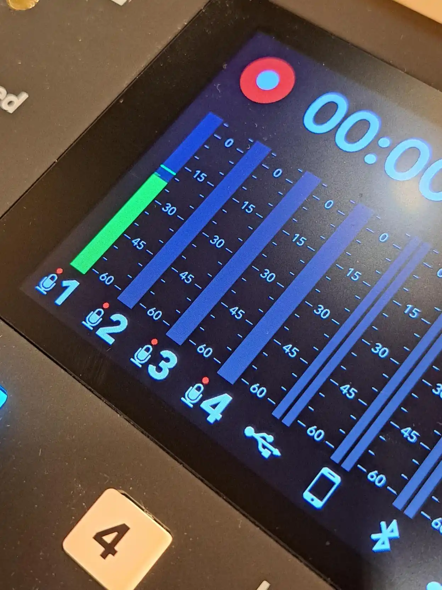
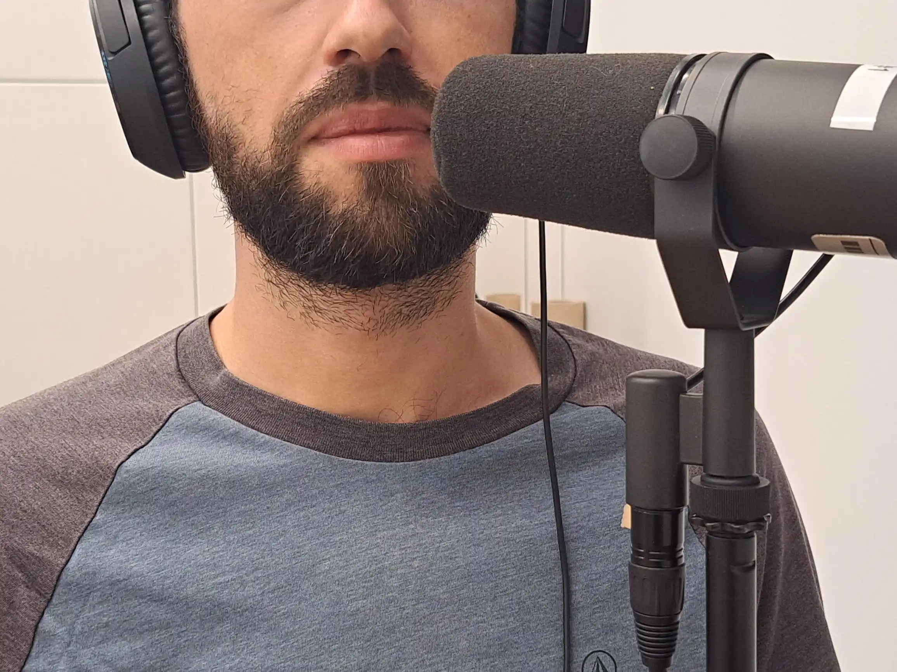
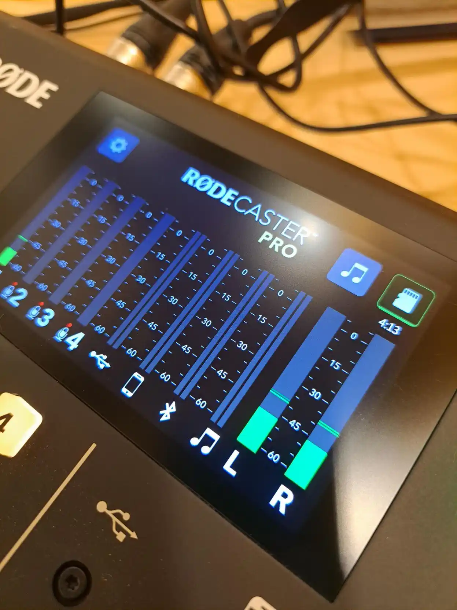
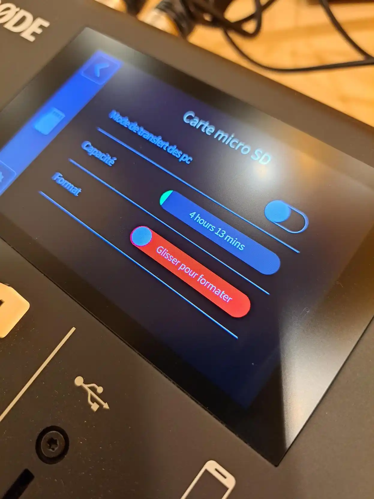
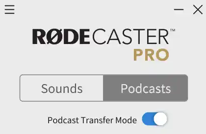
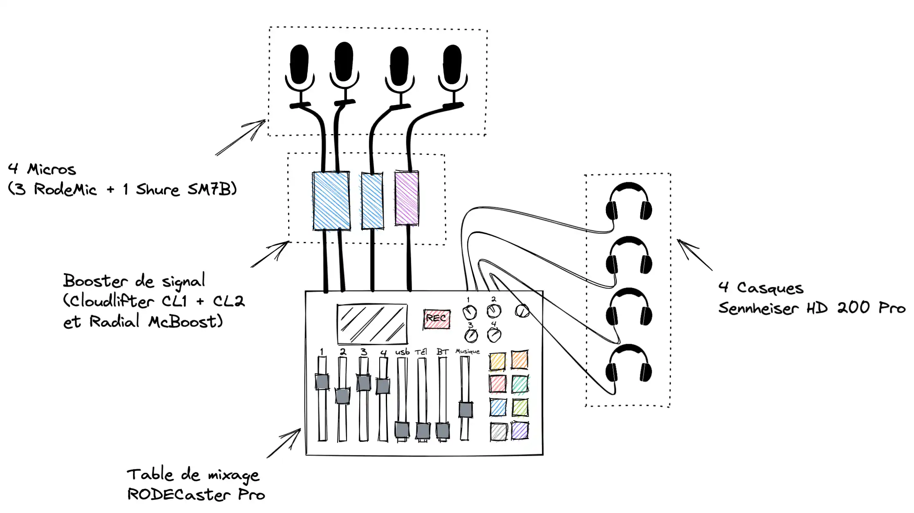
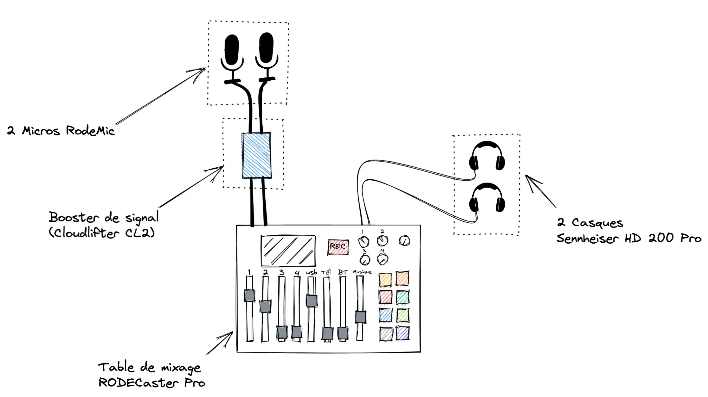

# Guide d'utilisation du RodeCaster Pro

!!! info
    Ce guide vous permet une première prise en main de la console d’enregistrement RodeCaster ainsi que ses accessoires pour un enregistrement sonore. Vous avez des questions? N’hésitez pas à contacter un [membre de notre équipe](../../a-propos/equipe.md).

## Réglages des niveaux

- Allumer la table RodeCaster Pro avec le bouton rouge qui se trouve derrière.
    
{ width=500 }

- Augmenter le volume d’enregistrement des micros que vous allez utiliser à moitié (identifié avec des numéros : MIC #1, MIC #2, etc.)
    
{ width=500 }

- Augmenter le volume des casques que vous allez utiliser (Casque #1, Casque #2, etc.).
    
{ width=500 }

- Parler devant le micro pour voir le niveau sonore affiché à l’écran. Ajuster légèrement le volume d’enregistrement jusqu’avoir des pics autour de -15dbs.
    
{ width=500 }

!!! tips
    Pas besoin d’augmenter le volume d’enregistrement au maximum, cela augmente la sensibilité du micro qui captera les bruits ambiants, ce qui est à éviter. Si vous sentez que le volume est bas, parlez plus fort ou ajustez le volume de votre casque.

- Le micro doit être à hauteur de la bouche et à une distance de moins de 10 cm (voir la photo ci-bas). Idéalement, il serait préférable de mettre le micro à côté de votre bouche, en angle, afin d’éviter d’avoir des *pops (bruits parasites)*.
    
{ width=500 }

- Régler ensuite le niveau des casques.

## Espace disque

- En haut de l’écran, à droite, est indiqué le nombre d’heure d’enregistrement que vous pouvez encore faire. Si l’espace n’est pas suffisant, vous pouvez formater la carte SD en appuyant sur l’icône de la carte SD et glissez pour formater.
        
{ width=500 }

        
{ width=500 }
        
## Environnement sonore

- S’assurer que les téléphones et autres appareils soient en mode silencieux (désactiver aussi le mode vibreur).
- Faire attention aux bruits qui vous entourent : une chaise qui bouge, etc.

## Transfert des fichiers

!!! Warning "Attention! Veuillez lire attentivement ce qui suit :"
    - Vous devez faire l’exportation immédiatement après l’enregistrement. Les bibliothèques ne peuvent êtres tenues responsables des données perdues.
    - On vous recommande fortement de faire aussi une copie de vos fichiers [dans votre espace OneDrive](http://o365.umontreal.ca/) ou un support de stockage externe.

Maintenant que vous avez terminé votre enregistrement, il est temps de faire le transfert vers votre ordinateur depuis le RODECaster Pro.

### Téléchargez le logiciel RODECaster Pro Companion App

- Téléchargez le logiciel :
    - Pour [Windows](https://edge.rode.com/zip/page/3/modules/11/RCP%20Companion%20App%20Installer%20Windows.zip)
    - Pour [MAC](https://edge.rode.com/zip/page/3/modules/11/RCP%20Companion%20App%20Installer%20Mac.zip)
- Installez le logiciel.

### Connectez votre ordinateur au RODECaster Pro

- La connexion se fait par câble USB.
- S’assurer que la table RODECaster Pro est allumée.
- Au lancement du logiciel, allez vers l’onglet **Podcasts** et activez **Mode de transfert des podcasts**.

{ width=300 }

- Cliquez sur le dernier enregistrement en haut de la liste. Une nouvelle fenêtre s’affichera à côté.
- Dans **Sélectionnez votre plateforme**, choisir **Custom***.*
- Dans **Paramètres avancés**, voici les changements à effectuer :
    - File Format : **WAV**
    - Taux d’échantillonnage : **48000**
    - Débit binaire : **N/A**
    - Loudness (LuFs) : -**14**
- Cliquez sur **Exportation**.

Faites preuve de patience! L’exportation prendra du temps. Si vous avez plusieurs fichiers à exporter, répétez les étapes pour chaque enregistrement.

Les paramètres choisis vont permettre d’avoir une qualité sonore supérieure et des fichiers qui seront prêts pour l’étape suivante : l’édition.

Une fois l’exportation terminée, vous allez avoir 9 fichiers de format WAV dans le dossier de destination. Chaque source sera enregistrée séparément (8 en tout) et un fichier, le **Stereo Mix.wav**, comportera toutes les pistes mixées ensemble. C’est ce fichier qui nous intéresse pour la suite.

## Schémas des branchements
    
En cas de doute sur le branchement, voici les schémas des branchements selon les studios : 
    
### Bibliothèque des sciences du Campus MIL
    

### Bibliothèque de mathématiques et informatique

