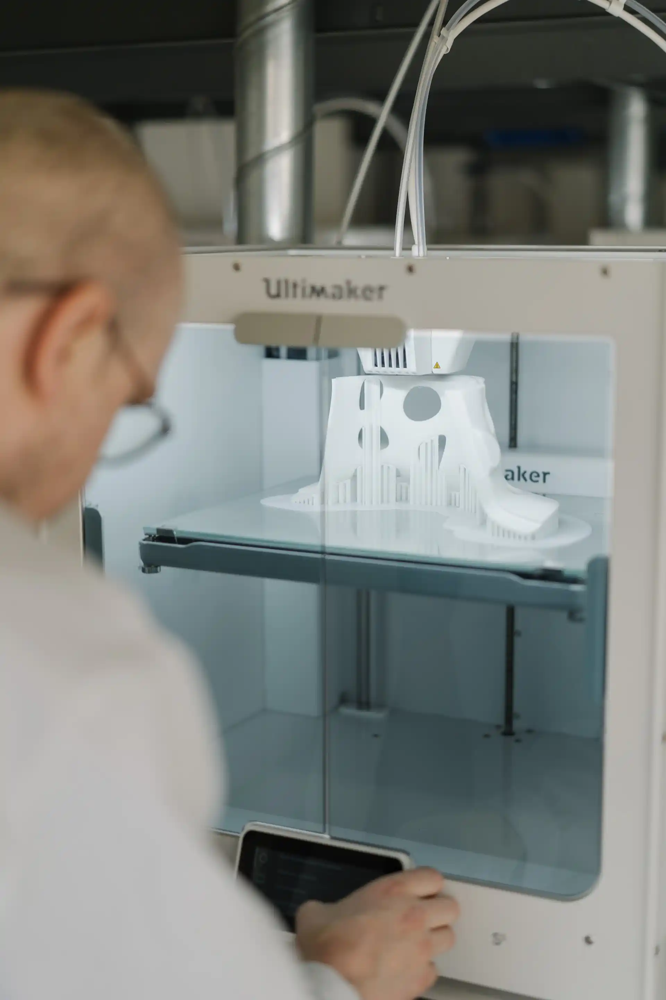

# Impression 3D

{ width=300rem align=left } 

L’impression 3D consiste à reproduire un objet à partir d’un modèle en 3D conçu par ordinateur. Cet objet tridimensionnel est créé par un dépôt successif de couches de matériaux.

À partir d’un modèle numérique conçu en 3D, un logiciel qu’on appelle *Slicer* découpe le modèle en plusieurs couches selon un paramétrage choisi. L’extrudeur de l’imprimante chauffe le plastique et vient le déposer couche par couche en suivant les instructions établies par le *Slicer*. Un système de ventilation refroidit instantanément le plastique déposé pour le solidifier. C’est ce qu’on appelle la fabrication additive. 

- :material-folder-star: [Guide de l'impression 3D](introduction.md)
- :material-folder-star: [Prusa i3 Mk3s+](prusa.md)
- :material-folder-star: [Ultimaker](ultimaker.md)
- :material-folder-star: [Zortrax Inkspire](prusa.md)

