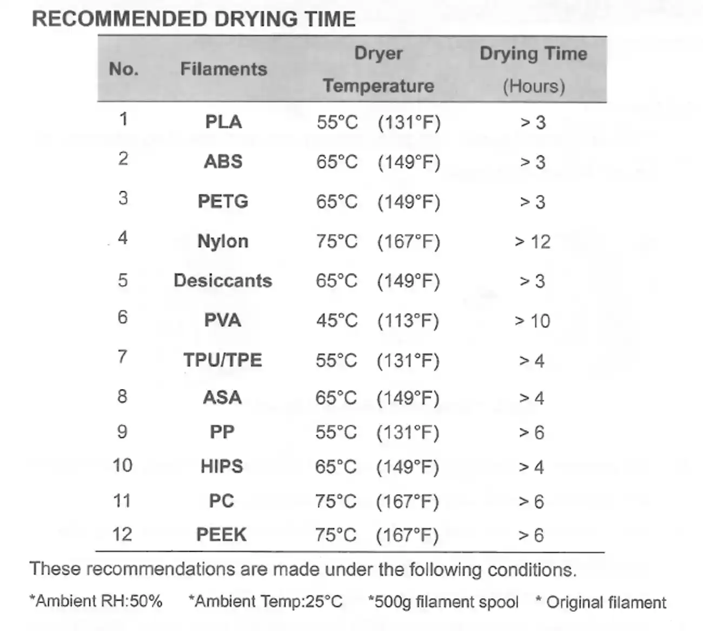
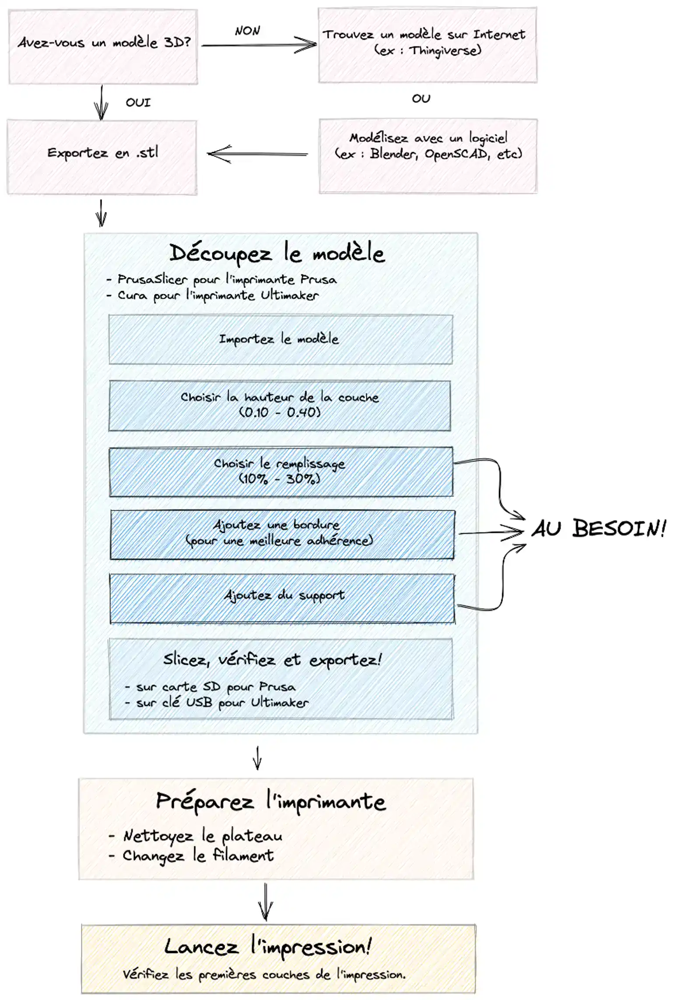
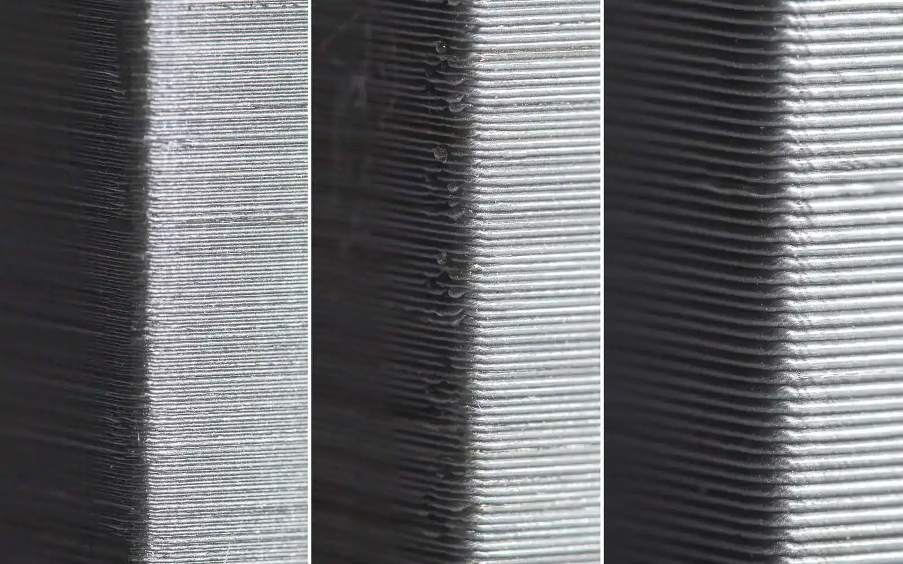
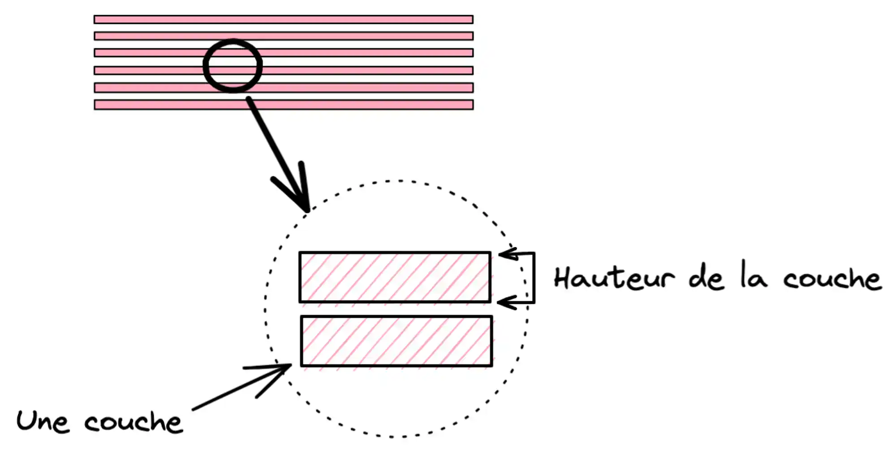
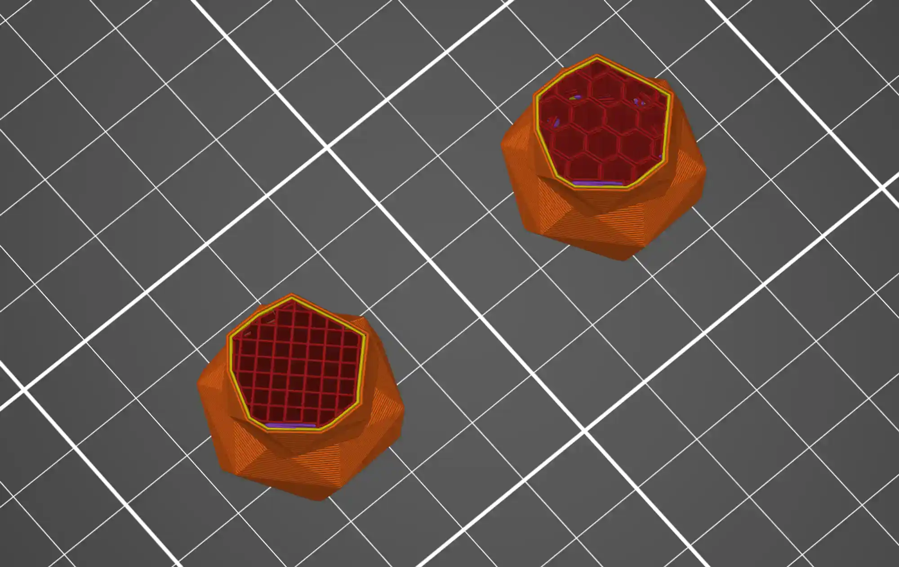
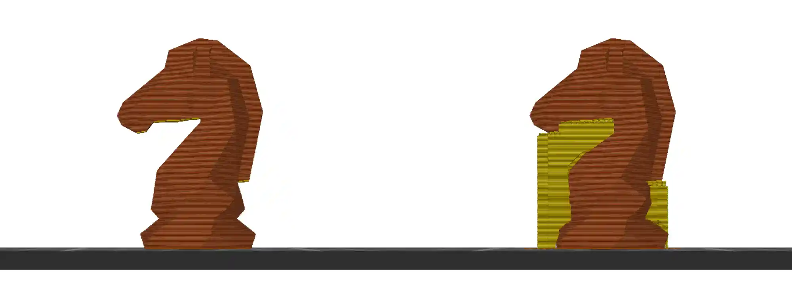
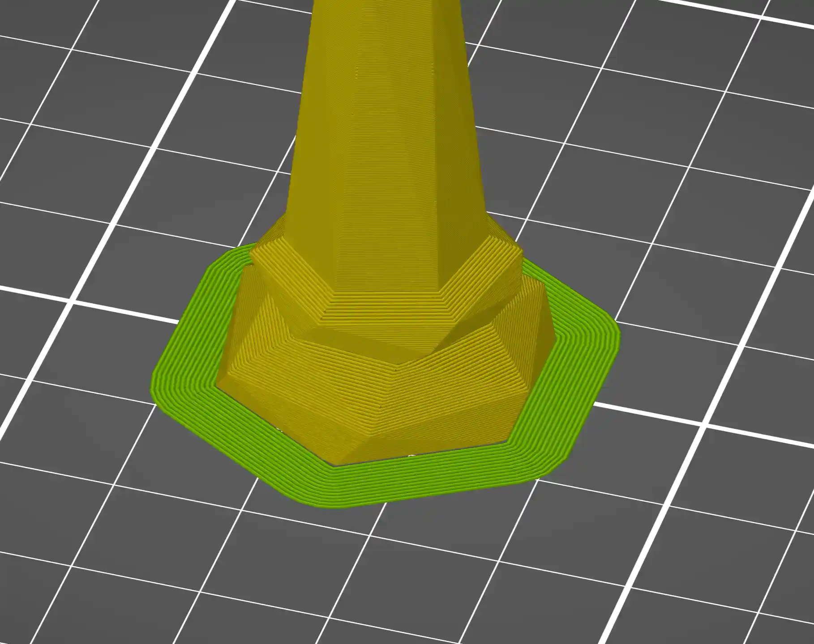
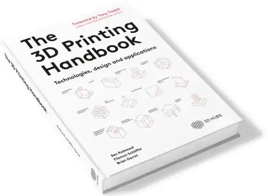

# Introduction à l'impression 3D

!!! note "Votre contribution est la bienvenue!"
    Cette page est en constante évolution. Si vous aussi vous voulez contribuer à son amélioration, consultez [la section Communauté](../communaute/index.md).

## **Qu’est-ce que l’impression 3D?**

L’impression 3D consiste à reproduire un objet à partir d’un modèle en 3D conçu par ordinateur. Cet objet tridimensionnel est créé par un dépôt successif de couches de matériaux.

À partir d’un modèle numérique conçu en 3D, un logiciel qu’on appelle *Slicer* découpe le modèle en plusieurs couches selon un paramétrage choisi. L’extrudeur de l’imprimante chauffe le plastique et vient le déposer couche par couche en suivant les instructions établies par le *Slicer*. Un système de ventilation refroidit instantanément le plastique déposé pour le solidifier. C’est ce qu’on appelle la fabrication additive. 

## **Matériaux**

### PLA (acide polylactique)

L’’acide polylactique ou polylactide, est un thermoplastique fabriqué à partir de ressources renouvelables telles que l’amidon de maïs (Amérique du Nord), les racines de tapioca (essentiellement en Asie) ou la canne à sucre. Ce matériau se distingue des autres filaments qui proviennent pour la plupart de la distillation et de la polymérisation de réserves de pétrole non renouvelables.

Ce matériau est devenu populaire dans l’industrie de l’impression 3D en raison de ses origines plus écologiques et de ses propriétés mécaniques. On l’extrude entre 190°C et 230°C. Ce matériau est biodégradable, mais uniquement en compostage industriel.

Contrairement à l’ABS (plastique à base de pétrole), le PLA est moins durable, plus fragile et plus sensible à la chaleur mais reste une excellente option pour du prototypage rapide : il est facile à imprimer, sans risque d’obstruction de la buse et à une température plus basse que les autres matériaux et émane peu d’odeur.

Bien que le PLA dans son état naturel ne soit pas nocif au contact des aliments, en raison des lacunes microscopiques dans les couches, les bactéries peuvent s’y loger. De plus, les produits utilisés pour la couleur ne sont pas sans danger. Il est donc déconseillé d’imprimer des objets qui vont être en contact avec des aliments.

!!! tip "Ressources en ligne"

    [Things you should know about PLA ](https://www.youtube.com/watch?v=unmvWkfpmRE){:target="_blank"}

    [Properties Table ](https://www.simplify3d.com/support/materials-guide/properties-table/?highlight=pla){:target="_blank"}

    [Materials - Prusa 3D ](https://help.prusa3d.com/en/materials){:target="_blank"}

### PVA

L'alcool polyvinylique est un polymère synthétique soluble dans l'eau. Il permet d'imprimer du support sur des modèles complexes. Ce matériau est très sensible à l'humidité. 

### **Températures**

Les températures recommandées sont sauvegardées dans le logiciel de découpe, mais aussi inscrites sur les bobines de filament. Les températures recommandées pour la fusion du PLA se situent entre 190°C et 230°C et le plateau chauffe entre 50°C et 70°C pour maximiser l’adhésion de l’objet.

## Entreposage des filaments

Le bon stockage des bobines de filament est important, puisqu’à l’air libre, le filament a tendance à absorber l’eau de l’air (l’hydroscopie), ce qui peut causer des problèmes lors de l’impression.

- Bloquez le bout du filament dans un des trous de la bobine afin d’éviter de mêler les filaments entre eux.
- Coupez en diagonale le bout du filament que vous allez utiliser avec une pince coupante afin de faciliter l’introduction du filament dans le trou prévu à cet effet.
- Toujours mettre la bobine non utilisée dans un sac d'emballage et si possible, avec un petit sac de gel de silice afin d’absorber l’humidité.
- Entreposer par la suite dans une boîte fermée afin d’éviter le contact avec la lumière.
- Pour savoir si le filament est encore bon à être utilisé, prenez un bout d’environ 5 cm et essayez de le tordre. Le filament ne doit pas se casser facilement.

Lorsqu’une bobine de filament a absorbé trop d’humidité on peut utiliser le séchoir à filament selon les spécifications recommandé par type de filament.

<figure markdown>
  { width="600" }
  <figcaption>temps de séchage recommandé.  </figcaption>
  [Source ](https://www.printdry.com/wp-content/uploads/2020/09/PrintDry_Filament-Dryer_manual_1908_1.pdf){:target="_blank"}
</figure>

!!! question "Ressources en ligne"
    [Humidité: la grande ennemie des filaments pour l'impression 3D ](https://filament2print.com/fr/blog/45_probl%C3%A8mes-humedite-filaments-3d.html){:target="_blank"}

    [WHY you NEED TO DRY your FILAMENTS! ](https://www.youtube.com/watch?v=FAXUjZZER5E){:target="_blank"}

    [6 filament dryer test - which one dries better? eBox, eBox Lite, Sunlu, Sovol, Creality, Eibos ](https://www.youtube.com/watch?v=6VB-pEvSed4){:target="_blank"}

    [Printing issues related to humid filament ](https://support.bcn3d.com/knowledge/humid-filament-bcn3d){:target="_blank"}

    [What Effect Does Moisture Have on 3D Printer Filament Storage? (And how to fix it) ](https://blog.gotopac.com/2018/03/01/how-3d-printer-filament-storage-cabinets-instantly-improve-3d-print-part-quality/){:target="_blank"}

## **Les grandes étapes**

<figure markdown>
  { width="600" }
  <figcaption>Les grandes étapes de l'impression 3D (cliquez sur l'image pour agrandir)</figcaption>
</figure>

### **Modèles**

La première étape vers l’impression 3D, c’est de chercher un modèle 3D… ou le concevoir!

- **Depuis Internet**

[Où trouver des modèles 3D?](modeles.md)

- **Modéliser votre propre pièce**

Vous pouvez aussi modéliser votre propre modèle 3D en utilisant un logiciel de modélisation. Chaque logiciel a ses points forts et ses faiblesses.

Voici une page expliquant quelques principes de modélisation importants pour l’impression 3D. Les fonctions sont celles d’une ancienne version de Blender, mais elles sont toujours utilisées dans la version actuelle : [Tutoriel Blender ](https://www.sculpteo.com/fr/tutoriel/tutoriel-blender/){:target="_blank"}

### **Découpe du modèle**

Le logiciel de découpe, ou *Slicer*, permet de découper en plusieurs couches un fichier 3D en **.STL** ou **.OBJ** selon des paramètres choisi, comme la hauteur de la couche, le remplissage, les supports, etc. Une fois le modèle découpé, il est possible de visualiser couche par couche les mouvements de l’extrudeur afin de vérifier que l’impression se déroulera sans problème, par exemple en vérifiant qu’il n’y a pas de dépôt de plastique dans le vide. Le logiciel exporte par la suite un fichier **.GCODE** contenant une suite d'instruction à l'imprimante afin de matérialiser le modèle. Ce fichier doit être enregistrer sur le périphérique de stockage qui sera branché à l’imprimante 3D (carte SD pour la Prusa et clé USB pour l’Ultimaker)..

<figure markdown>
  { width="600" }
  <figcaption>Modèle 3D .stl ou .obj - Découpage du modèle - Fichier .gcode - Impression de l’objet (cliquez sur l'image pour agrandir)</figcaption>
</figure>

Il existe plusieurs logiciels de découpe, la plupart sont libre et à code source ouvert. 

Les entreprises de fabrication d'imprimante 3D proposent leurs propres logiciels de découpe afin d'offrir des fonctionnalités propres à leurs imprimantes. Certaines utilisent .GCODE comme extension du fichier de sortie, d'autres dans un format propriétaire. 

### **Utilisation des profils**

Les profils sont un ensemble de paramètres prédéfinis dans le *Slicer*. Ils peuvent être modifiés à loisir. Des profils par défaut sont configurés, mais il faut tout de même vérifier les paramètres et les mouvements de l’extrudeur avant d’enregistrer le fichier sur le périphérique de stockage.

#### **Épaisseur**

<figure markdown>
  { width="600" }
  <figcaption>de gauche à droite : 0.05mm, 0.20mm et 0.30mm. </figcaption> [Source ](https://www.hubs.com/knowledge-base/impact-layer-height-3d-print/)
</figure>

L’épaisseur d’une couche est habituellement de 0,2 mm. Il est possible de descendre jusqu’à 0,1 mm si l’objet est très détaillé ou s’il subira des forces parallèles aux couches. Si tel est le cas, il est recommandé de revoir le sens d’impression pour que les forces soient exercées perpendiculairement aux couches d’impressions. Notez que la durée d’impression sera deux fois plus longue à 0,1 mm qu’à 0,2 mm.

<figure markdown>
  { width="600" }
  <figcaption>Hauteur de la couche</figcaption>
</figure>

#### **Remplissage (résistance)**

Le remplissage agit sur la solidité et, dans une moindre mesure, sur la vitesse d’impression et la souplesse d’un objet. En effet, le PLA n’est pas suffisamment flexible pour supporter la déformation. Le remplissage s’exprime en pourcentage. Une valeur typique se situe entre 5% et 20%. Il est possible d’imprimer sans remplissage (0%), ou entièrement plein (100%) selon les cas. Il existe aussi différents motifs de remplissage. Ils ont chacun leurs avantages.

<figure markdown>
  { width="600" }
  <figcaption>À gauche un remplissage à 40% avec le motif Grille (Grid) et à droite un remplissage à 20% avec le motif Nid d’abeille (Honeycomb)</figcaption>
</figure>

!!! note "Ressources en ligne"

    [Tout ce que vous avez besoin de savoir sur les remplissages - Prusa Printers ](https://blog.prusaprinters.org/fr/tout-ce-que-vous-avez-besoin-de-savoir-sur-les-remplissages_43579/){:target="_blank"}

    [Optimisation du remplissage des impressions 3D - Makershop ](https://www.makershop.fr/blog/optimisation-remplissage-impressions-3d/){:target="_blank"}

    [Comment optimiser le remplissage de vos impressions 3D ? ](https://5d-impression.com/blog/comment-optimiser-le-remplissage-de-vos-impressions-3d-b53.html){:target="_blank"}

#### **Support**

Le support est utilisé pour imprimer les porte-à-faux. L’impression doit obligatoirement avoir une surface de contact pour se déposer. Pour la première couche il s’agit du plateau, pour les couches suivantes il s’agit de la couche précédente. Si le matériau se dépose dans le vide, il faut créer un support. Le support peut également être utilisé pour augmenter la surface de contact de l’objet sur le plateau et éviter un décollement.

<figure markdown>
  { width="600" }
  <figcaption>À gauche, une pièce sans support. À droite, une pièce avec du support (en jaune)</figcaption>
</figure>

!!! warning "Choses à savoir"
    - Rajouter du support augmente la durée de l'impression.
    - Il est possible d'imprimer avec du support soluble dans l'eau (le PVA).
    - Il faut prévoir un post-traitement pour retirer le support et nettoyer la pièce imprimée.

!!! tip "Ressources en ligne"

    [Peindre du support - Prusa 3D ](https://help.prusa3d.com/fr/article/supports-peints_168584){:target="_blank"}

#### **Adhérence**

Si le plastique n’adhère pas au plateau, l’impression va échouer et en plus de gaspiller du matériau, cela risque d’abîmer l’imprimante. Pour que le filament reste fixé au plateau durant l’impression, une bordure de quelques millimètres de largeur, le *brim*, permet de maximiser la surface de contact, et donc améliore l’adhérence de la matière sur le plateau. Il s’agit d’une couche qui est facilement détachable une fois l’impression terminée. 

<figure markdown>
  { width="600" }
  <figcaption>En vert, le *brim* et en jaune, la pièce à imprimer.</figcaption>
</figure>

## **Avant l’impression**

### **Nettoyage**

Assurez-vous de bien nettoyer le plateau avant de lancer l’impression. Pour cela, utilisez du Windex si c’est une vitre et de l’alcool isopropylique à 99% si c’est pour la Prusa. N’utilisez aucun autre produit. Ne jamais déposer directement le produit sur le plateau, utilisez plutôt du papier brun pour l’Ultimaker et une lingette microfibre pour la Prusa (à cause de la colle, le papier brun reste collé sur le plateau).

Si le plateau n’est pas nettoyé, la pièce peut se décoller pendant l’impression. Nettoyer seulement quand le plateau est froid, sinon le produit va s’évaporer rapidement.

Nettoyer le dépôt de filament qu’il peut y avoir sur la buse avec une petite pince. Il est bien plus facile de procéder à ce nettoyage pendant la chauffe de cet élément.

### **Changement de la bobine de filament**

- Changez le filament avec la couleur de votre choix. N’oubliez pas d’entreposer le filament que vous n’allez pas utiliser dans un sac d'emballage afin de le protéger de l’humidité.
- Bloquez le bout du filament dans un des trous de la bobine afin d’éviter de mêler les filaments entre eux.
- Coupez en diagonale le bout du filament que vous allez utiliser avec une pince coupante afin de faciliter l’introduction du filament dans le trou prévu à cet effet.

## **Pendant l’impression**

Une fois l’impression lancée, il est important de surveiller les premières couches pour s’assurer que la pièce ne se décolle pas du plateau.

Si vous remarquez que les premières couches se décollent du plateau, ou que la pièce se plie sur les côtés (*warping*), arrêter l’impression. Voici quelques pistes pour y remédier :

- Le plateau n’est pas bien nettoyé : la graisse et la poussière sont les premiers ennemis. Nettoyez le plateau avec du Windex si c’est une vitre et avec de l’alcool isopropylique à 99% si c’est pour la Prusa. N’utilisez aucun autre produit.
- Peu de surface de contact : dans votre logiciel de découpage (*slicer*), ajoutez ou augmentez la taille de la bordure (*brim*) pour avoir plus de surface d’adhérence, surtout quand il s’agit de pièces de petite taille. Vous pouvez également ajouter un support pour éviter le *warping*. (photo)
- L’imprimante est sensible au moindre changement de la température ambiante. Évitez les courants d’air !
- Augmentez la température du plateau jusqu’à 70 degrés, soit sur le logiciel de découpe, soit directement depuis le menu de l’imprimante.
- Il est possible de changer les paramètres comme la température de la buse, du plateau ou la vitesse pendant l’impression. Faites-le avec précaution, il est recommandé de paramétrer ceci avant l’impression lors de la découpe du modèle. Au besoin, faites appel à un membre de l’équipe si vous avez besoin d’aide.
- Évitez de faire bouger la table où se trouve l’imprimante. La moindre secousse peut causer une erreur d’impression.
- Ne pas déplacer l’imprimante pendant l’impression.
- Ne surtout pas toucher le plateau ou la buse ou tout autre élément chauffant.

## **Après l’impression**

Une fois l’impression terminée, le plateau commencera à refroidir petit à petit jusqu’à atteindre la température de la pièce. Il est bien plus facile d’enlever la pièce une fois le plateau froid. N’utilisez pas de spatule ou d’objet en métal pour retirer votre impression du plateau. Évitez aussi de toucher au plateau afin de le laisser le plus propre possible.

### **Post-traitement**

Il existe plusieurs méthodes pour peaufiner votre impression. En voici quelques-unes :

- Le ponçage : c’est la méthode la plus populaire. Après avoir poncé le matériel, vous pouvez utiliser un produit de lissage pour couvrir les fissure. La meilleure option pour peindre du PLA, c’est d’utiliser la peinture acrylique.

### **Problèmes courants de l’impression 3D**

- L’imprimante ne peut pas imprimer dans l’air. Les objets avec des parties flottantes nécessiteront un support qui devra être retiré après l’impression.
- Adhésion : si la pièce se décolle, utiliser un *brim* pour augmenter la surface d’adhésion et nettoyer le plateau avec le produit adapté.

!!! question "Ressources en ligne"
    [Print Quality Guide ](https://www.simplify3d.com/support/print-quality-troubleshooting/){:target="_blank"}

    [Ultimate 3D Print Quality Troubleshooting Guide 2018 [All 44 Problems] ](https://rigid.ink/pages/ultimate-troubleshooting-guide){:target="_blank"}

    [3.3. Cleaning the PEI spring steel print sheet for proper adhesion ](https://projects.ttlexceeded.com/3dprinting_mk3_bed_cleaning.html#bed-cleaning-procedure){:target="_blank"}

!!!info "Livres disponibles aux bibliothèques en lien avec le sujet"
    { align=left width=200}
    [Redwood, B., Schöffer Filemon, & Garret, B. (2017). The 3d printing handbook : technologies, design and applications. 3D Hubs B.V. ](https://umontreal.on.worldcat.org/v2/oclc/1019921213){:target="_blank"}

