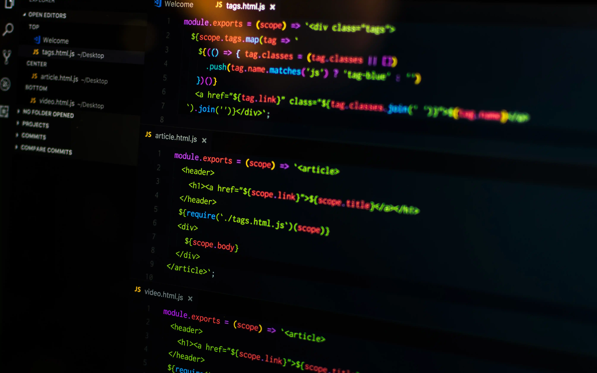

# Programmation

{ width=300rem align=left } 

Dans notre monde de plus en plus numérique, la compréhension de la programmation est devenue une compétence clé pour de nombreux domaines professionnels. Apprendre à coder permet de comprendre comment fonctionnent les logiciels, les applications et les sites web que nous utilisons au quotidien. De plus, cela permet également de développer des compétences en résolution de problèmes, en pensée critique et en créativité.

- :material-folder-star: [Apprendre **Processing**](processing.md)

