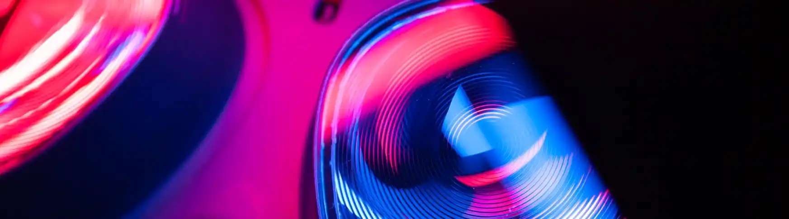

---
hide :
    - toc
---

# Réalité virtuelle

!!! info "À propos de la réalité virtuelle"
    La réalité virtuelle est une expérience immersive qui peut être intense, surtout si on l'essaye pour la première fois. [Lire les mises en garde](mises-en-garde.md).

## Disponibilité et réservation

Pour obtenir un casque de réalité virtuelle, présentez-vous au comptoir d’accueil de la [Bibliothèque Thérèse-Gouin-Décarie](https://bib.umontreal.ca/travailler/les-bibliotheques/therese-gouin-decarie) ou la [Bibliothèque des sciences](https://bib.umontreal.ca/travailler/les-bibliotheques/sciences).

Vous pouvez aussi réserver un casque en suivant ces liens :

- [Bibliothèque Thérèse-Gouin-Décarie](https://umontreal.on.worldcat.org/oclc/1246168559)
- [Bibliothèque des sciences](https://umontreal.on.worldcat.org/oclc/1246168952)

## Oculus GO

- [Guide d'utilisation](oculus-go.md)
- [Catalogue des expériences](catalogue.md)

