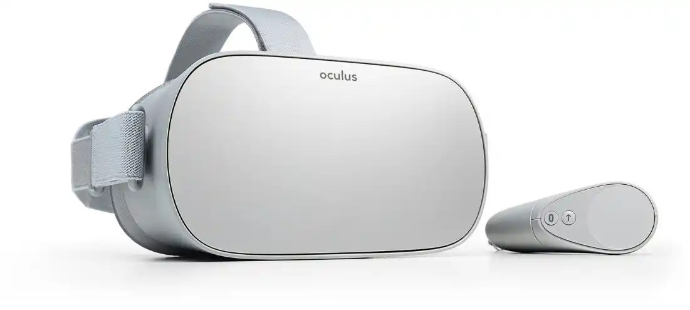
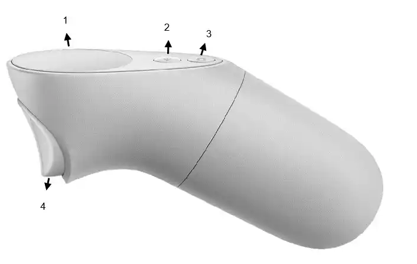

# Guide d’utilisation

## Présentation du casque

Le casque Oculus Go est un casque de réalité virtuelle autonome. On peut naviguer à l'intérieur de l'environnement en réalité virtuelle grâce à la manette. Le casque est préalablement configuré par l'équipe de la bibliothèque et une sélection d'applications est présente.

Ce casque offre 3 degrés de liberté (3DoF) : Grâce aux trois capteurs, l'accéléromètre, le gyroscope et le magnétomètre, le casque détecte les mouvements de la tête qui penche de gauche à droite, en arrière et en avant et qui tourne de gauche à droite.

Contrairement aux casques plus avancés comme le HTC Vive ou Oculus Rift S, qui offrent une plus grande liberté de mouvement, il est recommandé d'utiliser ce casque dans une position assise ou debout. Inutile de bouger dans l'espace : ce casque ne pourra pas suivre votre mouvement.

## Contenu du boîtier

1. Une lingette en microfibre
2. La manette
3. Le casque Oculus Go
4. Un câble USB
5. Chargeur mural (Bibliothèque des sciences seulement). Des chargeurs sont disponibles au comptoir de prêts de la Bibliothèque Thérèse-Gouin-Décarie.
6. Chargeur de piles incluant 3 piles rechargeables (Bibliothèque Thérèse-Gouin-Décarie seulement).
7. Réducteur de lunettes (Bibliothèque Thérèse-Gouin-Décarie seulement).

Veuillez-vous assurer que toutes les pièces se trouvent dans le boîtier avant d'utiliser le casque. Si une pièce est manquante, veuillez aviser sans délai le personnel au comptoir des services de la bibliothèque où vous avez emprunté le casque.

L'Oculus Go dispose aussi d'un écouteur intégré. Pour une meilleure immersion, utiliser un casque d’écoute. Le branchement de vos écouteurs se fait sur le côté du casque Oculus Go. Des casques d’écoutes sont aussi disponibles au comptoir des services de votre bibliothèque.

## Durée du prêt

La durée du prêt est de 7 jours renouvelable. 

## Manette et boutons

### Casque

1. Bouton de mise en marche/veille
2. Boutons de volume
3. Port de charge mini-USB
4. Sortie écouteurs et casques

### Manette

1. Touchpad : à utiliser avec le pouce. Vous pouvez presser dessus comme un bouton. S’utilise comme le trackpad d’un ordinateur.
2. Bouton de retour en arrière.
3. Bouton Oculus : Pour afficher le menu Oculus ou appuyer longuement pour réajuster la vue.
4. Bouton déclencheur : à utiliser avec l’index. Principalement pour sélectionner des éléments.

## Utilisation

### Allumer, le mode stand-by et éteindre le casque

- Pour allumer le casque, appuyez pendant environ 2 secondes sur le bouton de l’alimentation en haut du casque.
- Pour éteindre le casque, appuyez pendant environ 2 secondes sur le bouton d’alimentation. Une fenêtre s’ouvre pour confirmer la mise à l’arrêt du casque, confirmer en sélectionnant **Éteindre**.
- Pour le mode **stand-by**, appuyez rapidement sur le bouton d’alimentation. Ceci ne remplace pas la mise à l’arrêt du casque.
- La manette se déclenche automatiquement avec le démarrage du casque. Si la manette ne semble pas fonctionner, changez la pile.

### Utilisation du WIFI

Afin de profiter pleinement du potentiel du casque, connectez-le au WIFI. Toutefois, vous pouvez utiliser certaines applications et jeux sans connexion au réseau Internet.

### WIFI de l’université « UdeM avec cryptage »

Dans **Paramètres**, sélectionner **WI-FI**. Choisissez **UdeM avec cryptage**. Le casque vous invitera à remplir des champs, en voici les détails :

| Méthode EAP | PEAP |
| --- | --- |
| Phase 2 authentification | MSCHAPV2 |
| CA certificate | Sélectionner Ne pas valider |
| Identité | Votre code d’accès (ex. AB12345 ou p1234567) |
| Anonyme | le laisser vide |
| Mot de passe | Votre UNIP / mot de passe |

### Autre WIFI

Vous pouvez connecter le casque Oculus Go à n’importe quel WIFI à l’extérieur de l’université.

Dans **Paramètres**, sélectionner **WI-FI**. Choisissez la borne de votre choix, ensuite, entrez le mot de passe associé.

### Changer la position de la manette

La manette est réglée par défaut pour les droitiers. Si vous voulez changer cette configuration, veuillez suivre ces étapes :

Dans **Paramètres**, sélectionner **Tout voir**. Dérouler le menu et sélectionner **Manette**, changer **Main de la manette** de **Main droite** à **Main gauche**, ou l’inverse.

### Calibrer la manette

Regardez et pointez la manette devant vous, puis maintenez appuyé le bouton Oculus pour réinitialiser la position de l’écran et le pointeur de la manette.

### Contenu et compte

!!! warning "Attention"
    SVP ne pas déconnecter le compte des bibliothèques.

Le casque est connecté au compte des bibliothèques qui offre une sélection d’applications (gratuites et payantes). Si vous voulez ajouter une application ou un jeu, nous sommes ouverts aux propositions, simplement [nous envoyer un courriel](../a-propos/nous-joindre.md).

Le contenu personnel (liens visités, mots-clés, etc.) sera effacé du casque une fois retourné au comptoir de la bibliothèque d’emprunt.

### Durée d'utilisation et recharge

La durée estimée d’utilisation est de 1,5 à 2 heures pour des applications gourmandes en énergie (exemple : jeu vidéo) et de 2 à 2,5 heures pour de la vidéo simple.

Le temps de recharge est estimé à 3 heures.
